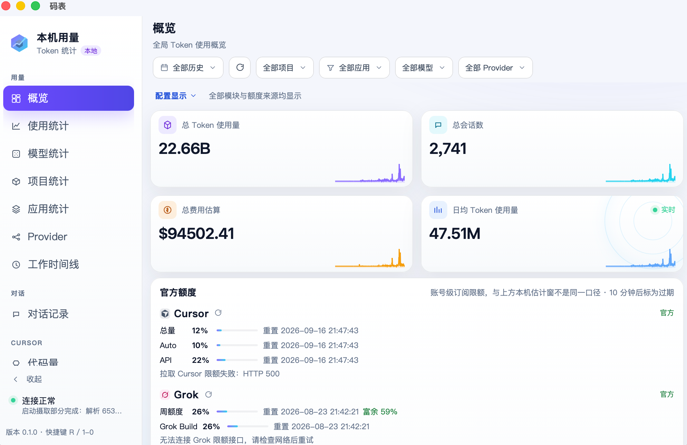
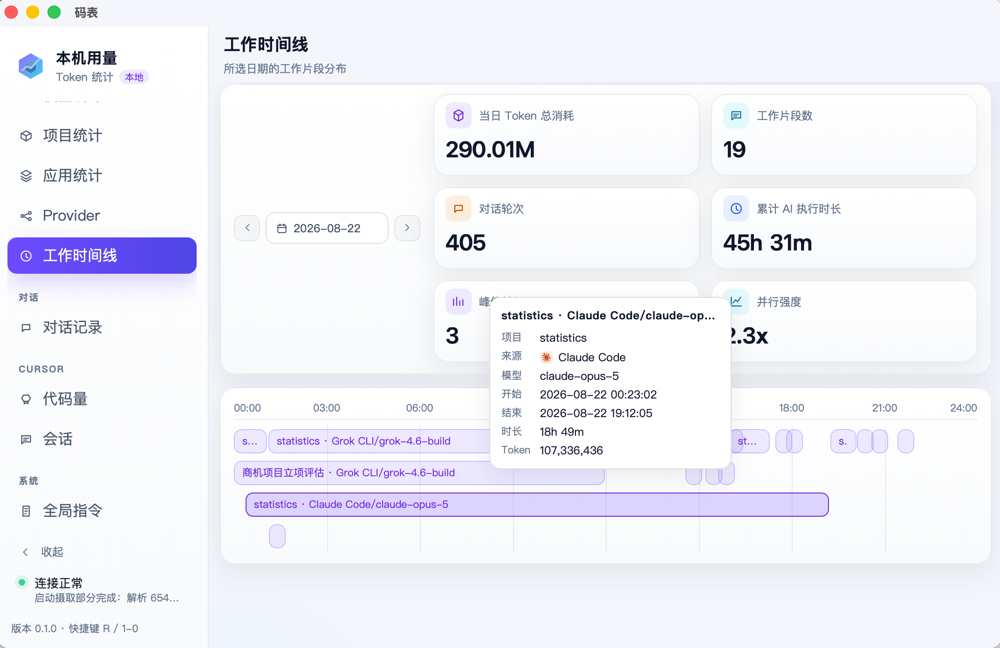
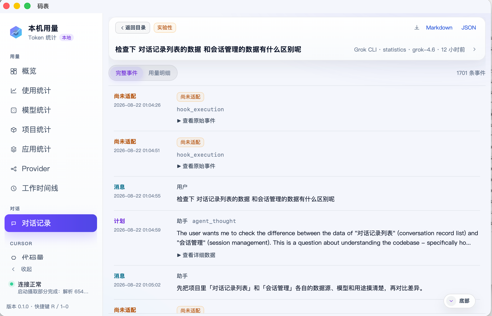
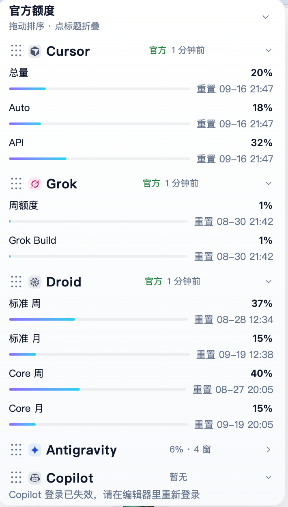

# 码表 (Mabiao)

[English](README.en.md) · [官网](https://mabiao.dev)

本机桌面应用：扫描各 AI 编程 CLI 留在本地的会话数据，归一成「消耗记录」，展示 token 用量、工作时间线与完整事件流。**默认只读、不上传本机消耗记录。**

[](https://github.com/qqzhangyanhua/mabiao/actions/workflows/ci.yml)
[](https://github.com/qqzhangyanhua/mabiao/releases/latest)
[](LICENSE)

<p align="center">
  
</p>

| 工作时间线 | 对话记录 | 菜单栏额度 |
|:---:|:---:|:---:|
|  |  |  |

## 支持的来源

码表扫的是本机目录，不代替各家官方仪表盘。路径可在设置页填写绝对路径，也可用环境变量覆盖（设置页优先），详见 [`docs/adr/0005-configurable-source-paths.md`](docs/adr/0005-configurable-source-paths.md)。

| 来源 | 本机 Token | 本机费用 | 说明 |
|------|:---:|:---:|------|
| Claude Code | ✅ | ✅ | 自带 `costUSD` |
| Codex | ✅ | ❌ | |
| pi | ✅ | ✅ | |
| OMP | ✅ | ✅ | 自带 `cost.total`；子代理计入父会话 |
| opencode | ✅ | ✅ | |
| grok | ✅ | ✅ | |
| kimi / gemini / dsh / copilot | ✅ | ❌ | dsh 需解压；copilot 仅会话结束时累计 |
| Factory / droid | ✅ | ❌ | 会话累计，无模型名 |
| Cursor | ⚠️ | ❌ | 代码量 + 账号级用量（读本机客户端登录态） |
| cursor-agent | ⚠️ | ❌ | Token 仅在包装落盘后可读 |
| qwen / amp | ❌ | ❌ | 本机无 Token（amp 用量在云端） |

口径、默认路径与限制见 [`CONTEXT.md`](CONTEXT.md)。

## 主要能力

- **总览与拆分**：按时 / 日 / 周 / 月看趋势，按来源、模型、Provider、项目、会话拆分；可导出 CSV / JSON，图表可另存图片
- **工作时间线**：按日把各来源会话铺成片段，看当天执行时长、对话轮次与并行强度
- **对话记录**：按需读本机正文与事件流（提问 / 思考 / 工具 / 回复），可导出 Markdown / JSON
- **额度分开展示**：本机 5 小时 / 7 天估计窗（非官方配额）与 **官方额度**分开；内置 Claude / Codex / Cursor / Grok / Droid / Antigravity / OpenCode / Copilot / Devin 九家账号并显示套餐名，设置里还可登记自定义提供商。官方额度行可按连续两次快照估计撞线时间（与本机 5 小时燃烧不是同一口径）。菜单栏显示今日花费和最紧的官方百分比
- **全局指令**：汇总各来源真正会加载的用户手写指令，与用量分区，不进 Token KPI
- **Cursor 代码量**：编辑器 AI 行数独立统计，不并入 Token KPI
- **本机缓存**：sqlite 可备份、恢复、按来源重建；源文件被清理后记录归档仍计入，不会静默消失
- **预算通知**：可设月度预算（美元）；本机估算或官方额度过阈值时各弹一次系统通知

## 数据与隐私

- 默认只读扫描本机各来源会话目录，**不上传本机消耗记录**
- 聚合结果缓存在本机 sqlite，可在设置页备份、恢复或重建
- Cursor 账号用量与官方额度只读本机各客户端已有的登录态（如 Cursor 的 `state.vscdb`），没有手动粘贴通路，也不落钥匙串；不会改写会话正文
- 唯一读钥匙串的地方是 Antigravity 官方额度（AGY CLI 把登录态写在 macOS 钥匙串里），非 macOS 上退回读客户端本机状态；其余本机文件摄取不涉及钥匙串
- 编辑全局指令会按白名单写入用户自己的指令文件，见 [`docs/adr/0010-writing-user-owned-files.md`](docs/adr/0010-writing-user-owned-files.md)

## 下载安装

安装包由 GitHub Actions 打好后挂在 [Releases](https://github.com/qqzhangyanhua/mabiao/releases)。当前公开版是 **[v0.1.3](https://github.com/qqzhangyanhua/mabiao/releases/tag/v0.1.3)**。

| 平台 | 产物 |
|------|------|
| macOS Apple Silicon | `.dmg`（`aarch64-apple-darwin`） |
| macOS Intel | `.dmg`（`x86_64-apple-darwin`） |
| Linux x64 | `.deb` / AppImage / `.rpm` |
| Windows x64 | NSIS `.exe` / MSI |

当前构建**未做代码签名**。macOS 首次打开若提示无法验证开发者，在访达中右键 → 打开，或：

```bash
xattr -cr "/Applications/Mabiao.app"
```

Windows 可能被 SmartScreen 拦截，选择「仍要运行」即可。托盘以 macOS 为一等公民，Linux / Windows 差异见 [`docs/platforms.md`](docs/platforms.md)。

## 从源码构建

前置：

- Node.js 20+
- [pnpm](https://pnpm.io/) 9（仓库钉在 `pnpm@9.15.0`，请勿用 npm / yarn）
- [Rust](https://rustup.rs/) stable
- Linux 还需 WebKitGTK 等系统库，见 [`docs/platforms.md`](docs/platforms.md)

```bash
pnpm install
pnpm tauri dev
```

开发时会弹出原生窗口，标题为「码表」。本机打安装包：

```bash
pnpm tauri build
```

跨平台安装包请走 GitHub Release 流水线，不要用本机 `pnpm tauri build` 代替发版。

## 开发

```bash
pnpm lint       # ESLint
pnpm lint:fix   # 自动修复
pnpm format     # Prettier
pnpm test       # Vitest（src/lib 纯函数）
pnpm build      # tsc + vite build
```

复跑本机 token 字段探测（仅开发者机器）：

```bash
cargo run --bin probe --manifest-path src-tauri/Cargo.toml
```

| 文档 | 内容 |
|------|------|
| [`CONTEXT.md`](CONTEXT.md) | 领域词汇、各来源采集现状 |
| [`docs/platforms.md`](docs/platforms.md) | 跨平台构建、GitHub 打包与发版 |
| [`docs/adr/`](docs/adr/) | 架构决策 |
| [`AGENTS.md`](AGENTS.md) | 怎么测、怎么加 Adapter |
| [`docs/probe/`](docs/probe/) | 本机字段探测记录 |

## 贡献

欢迎 Issue 和 PR。新增来源 = 往 UsageAdapter 表加一行 + 写一个适配器：在 `domain.rs` 注册，实现 `src-tauri/src/adapters/<source>.rs`，在表里登记扫描 / 发现 / 解析，加脱敏 fixture 与测试，并在改了归一化输出时递增 `ADAPTER_VERSION`。验证命令与分层检查见 [`AGENTS.md`](AGENTS.md)。PR 建议先开 draft，CI 绿后再 mark ready。

## 许可证

[MIT](LICENSE)
